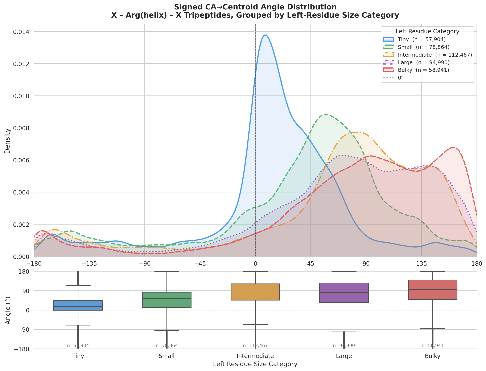

# Tripeptide Angle Analysis Pipeline

This project analyzes **X–Arg(helix)–X tripeptides** from PDB structures and computes the signed angle between Cα → centroid vectors. The results are grouped by left-residue size category and visualized using a KDE plot.

---
## Output



---

## Folder Structure

```
BET-104_tripeptide/
├── Snakefile
├── config.yaml
├── README.md
├── scripts/
│   ├── parse_pdb.py
│   ├── aggregate.py
│   └── plot.py
└── results/
    ├── angles.csv
    └── plot.png
```

---

## Run Command

```bash
snakemake --cores all --configfile config.yaml
```

This single command runs the entire pipeline.


---

## Output Files

- `results/angles.csv` → aggregated angle data  
- `results/plot.png` → final visualization  

---

## Notes

- Input PDB directory is defined in `config.yaml`
- DSSP is required for secondary structure assignment
- Pipeline runs in parallel using Snakemake
